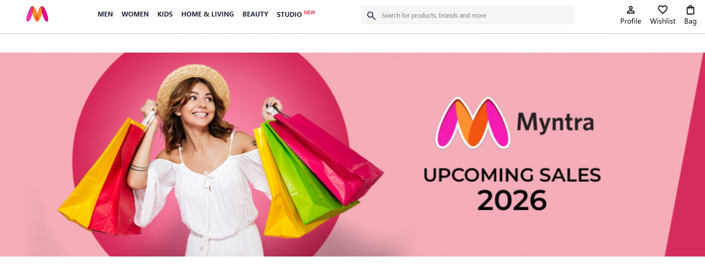

# Myntra Clone

A frontend clone of the Myntra homepage built using HTML and CSS.

## About the Project

This project is a frontend clone of the Myntra homepage built using HTML and CSS. It recreates key sections of the website, including the navigation bar, search bar, profile actions, promotional banner, brand offers section, category showcase, and footer. The project was created to strengthen my understanding of webpage structure, CSS layouts, Flexbox, and frontend UI development.

## Project Preview

  

## Features

* Navigation bar with category links
* Search bar with Material Icons
* Profile, Wishlist, and Bag action icons
* Promotional banner section
* Medal Worthy Brands section
* Shop by Category section
* Multi-column footer
* Structured and user-friendly layout

## Technologies Used

* HTML5
* CSS3
* Google Material Symbols

## Live Demo
https://stutirai.github.io/Myntra-Clone/

## Learning Outcomes

Through this project, I practiced:

* HTML page structure
* CSS styling
* Flexbox layouts
* Positioning and spacing
* UI recreation
* Frontend development fundamentals

## Author

**Stuti Rai**

B.Tech, Artificial Intelligence & Data Science
